# ICML 2026 Visual EDA Index

Static figures generated from processed CSVs. These are designed as report/presentation seed visuals, not final publication graphics.

## Figures

### topic_group_distribution.png

Official ICML topic-group balance across all 6,628 paper rows.

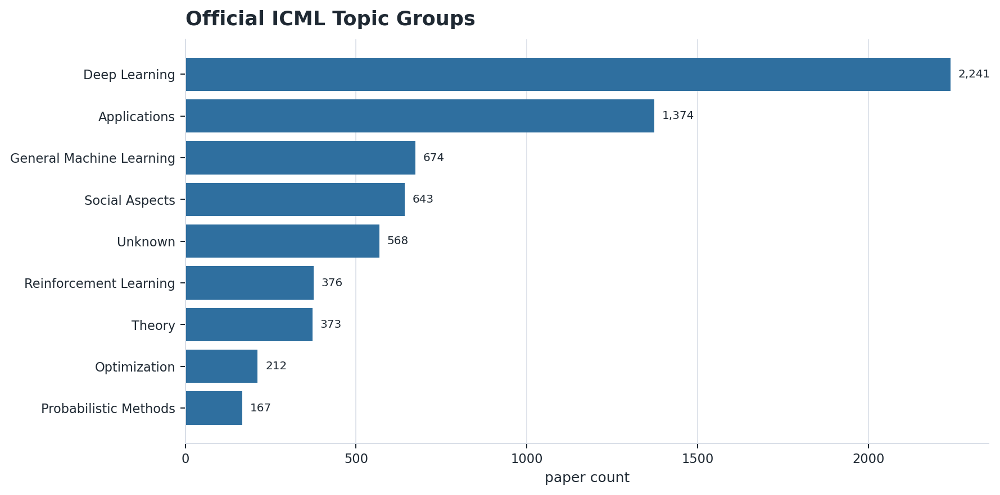

### theme_counts_orals.png

Rule-based cross-cutting theme counts with oral-designated counts overlaid.

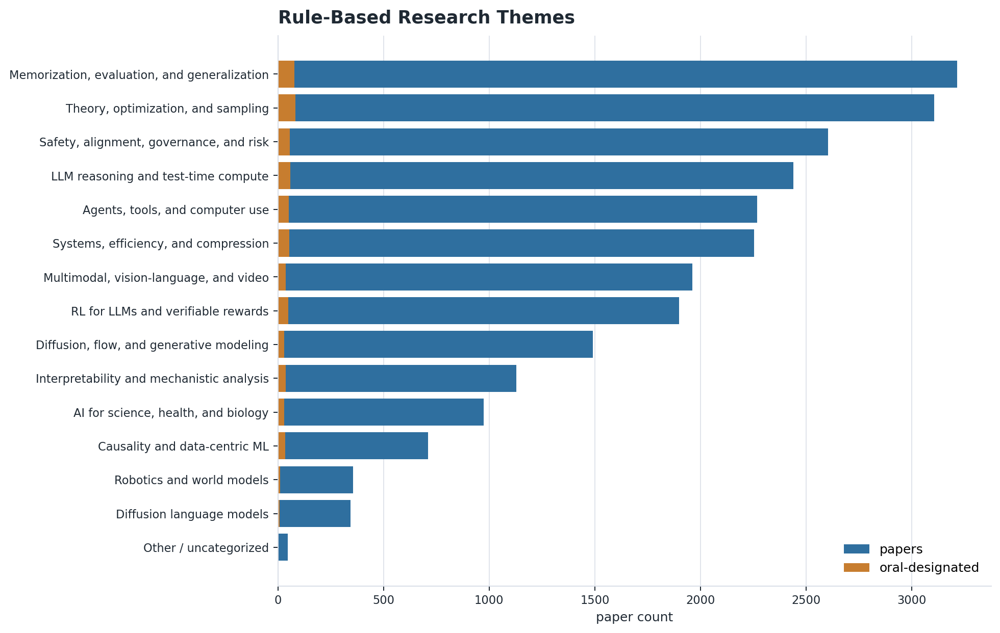

### cluster_vote_density_oral_enrichment.png

Clusters ranked by AlphaXiv public votes per paper, with oral enrichment shown as a second axis.

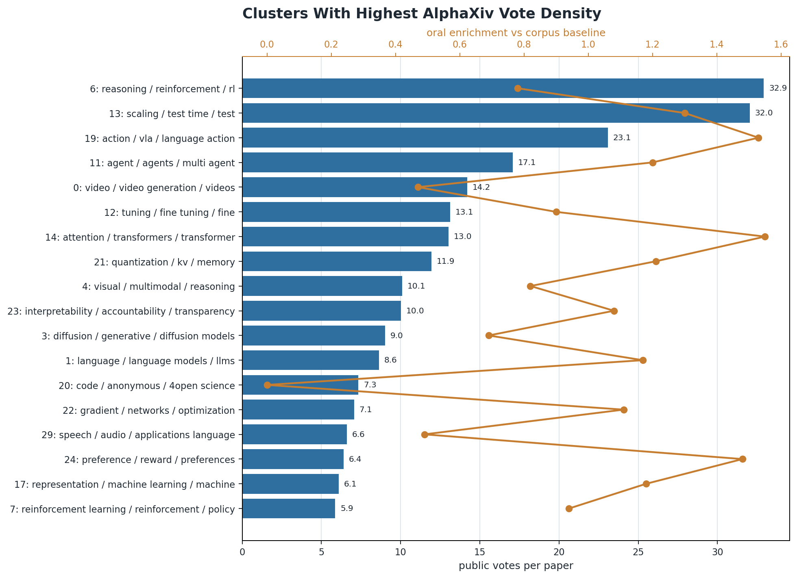

### cluster_public_vs_program_signal.png

Cluster-level divergence between public attention and program-committee signal.

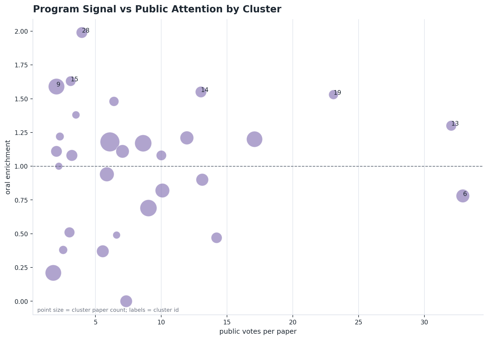

### alphaxiv_attention_distributions.png

Long-tailed AlphaXiv vote and recent-visit distributions.

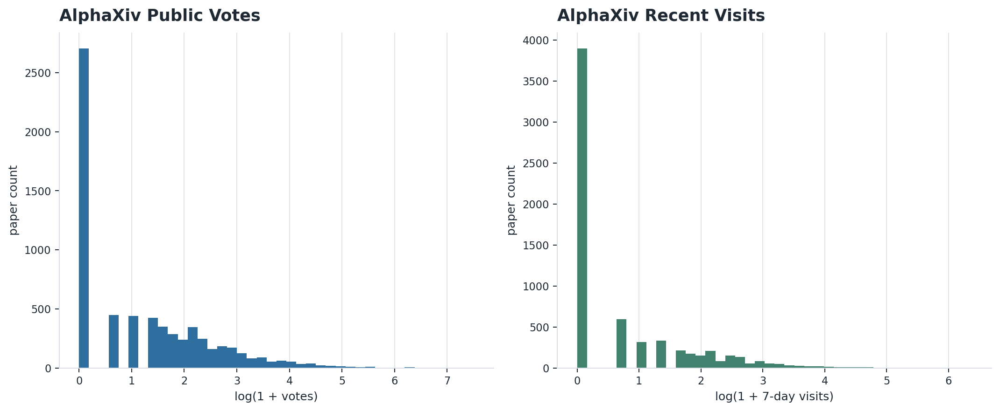

### top_canonical_institutions.png

Top canonical institutions after alias cleanup.

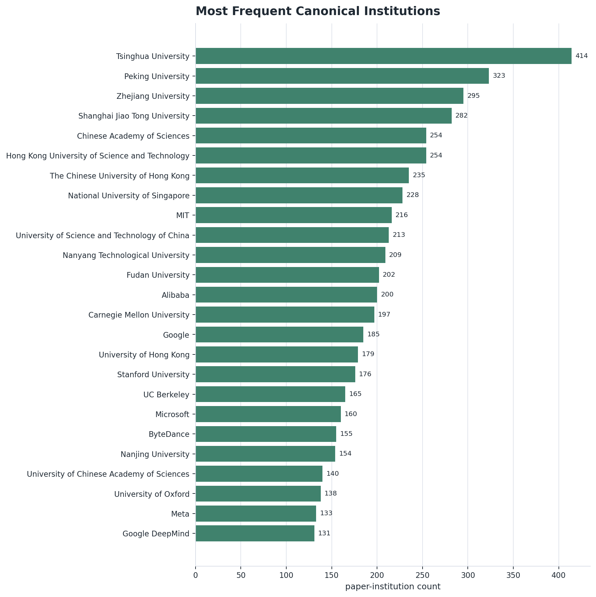

### sector_mix_papers.png

Paper-level sector mixes from canonical institution sectors.

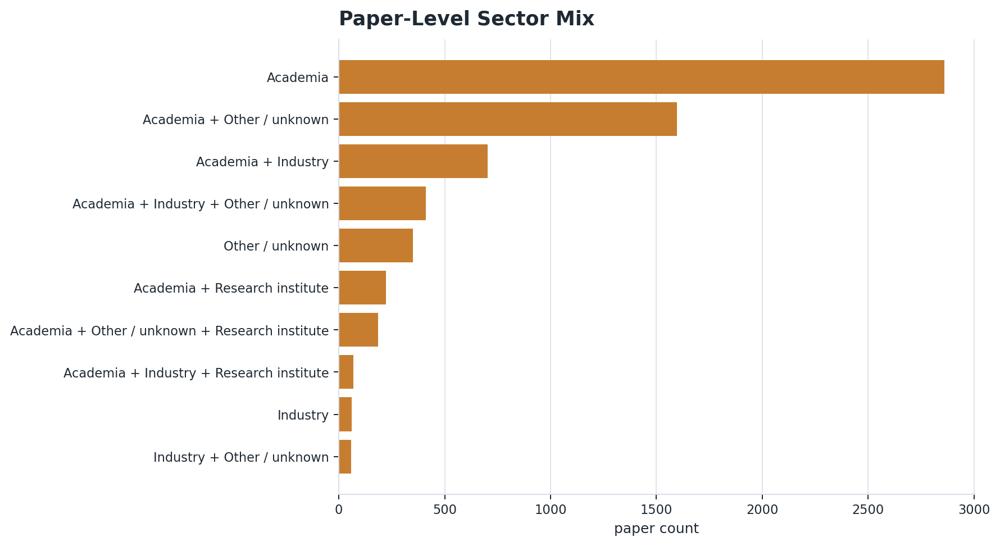

### institution_collaboration_hubs.png

Institution collaboration hubs by paper co-occurrence PageRank.

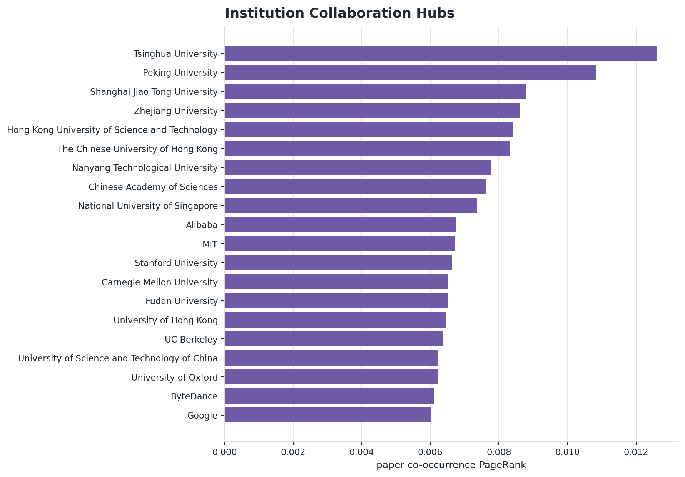

### team_size_distribution.png

Distribution of author counts per ICML paper.

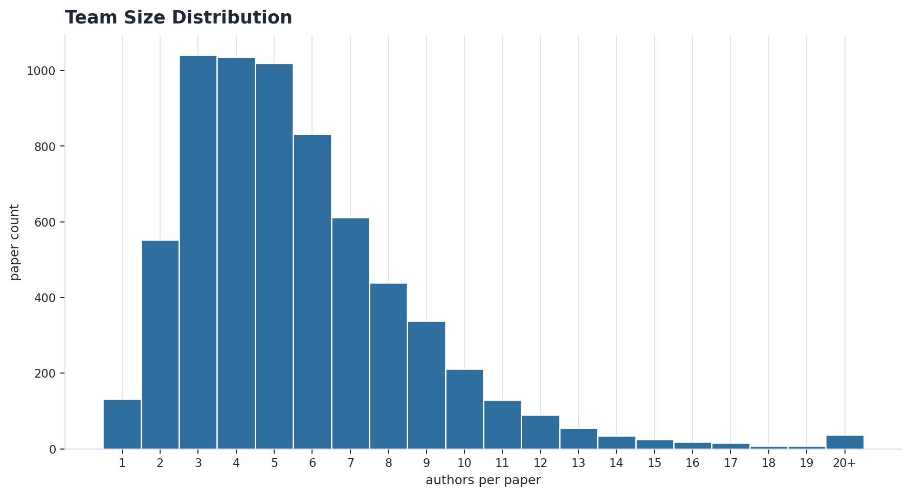

### semantic_cluster_map.png

Transformer embedding map of the ICML corpus, projected to two PCA dimensions and labeled by the largest semantic clusters.

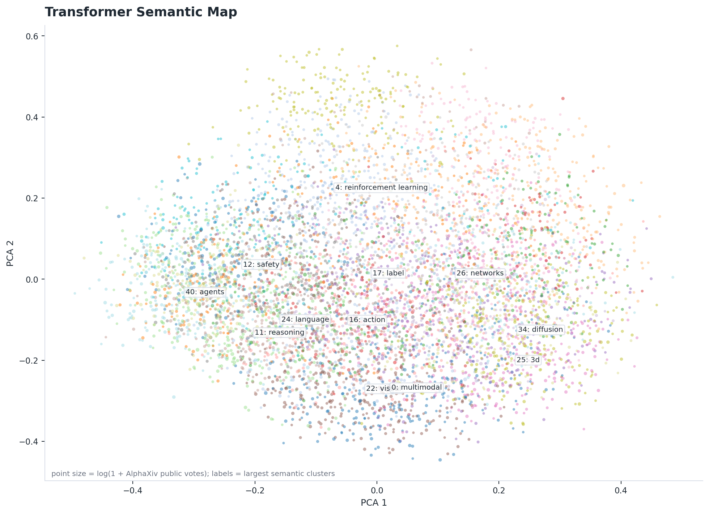

### semantic_cluster_vote_density.png

Semantic clusters ranked by AlphaXiv public votes per paper, with oral enrichment shown as a second axis.

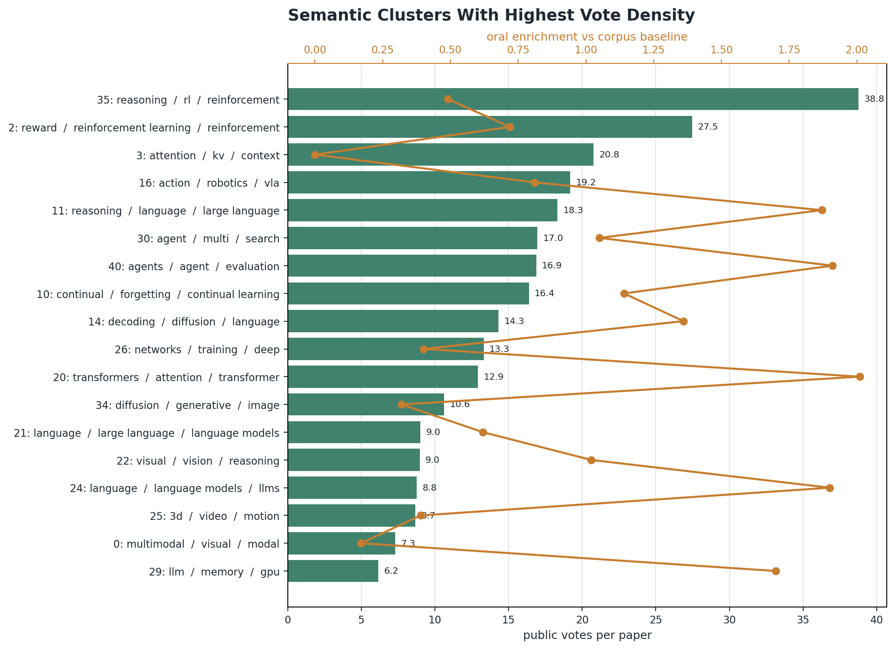

### manual_taxonomy_area_sizes.png

Curated report-level taxonomy area sizes, with GitHub URL share shown as a reproducibility proxy.

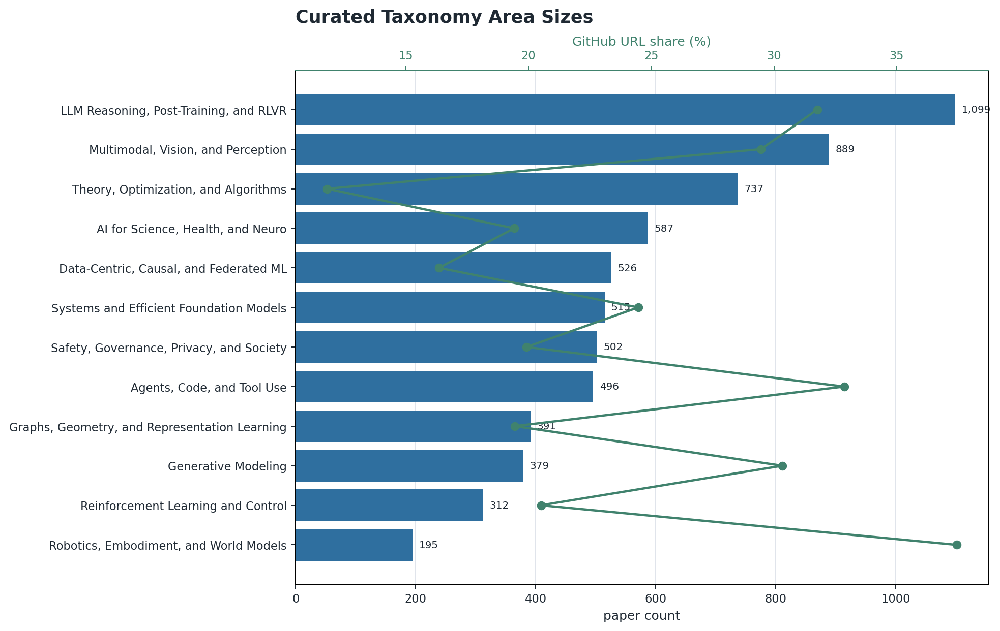

### evidence_contribution_mix.png

Heuristic primary contribution-type mix across curated taxonomy areas.

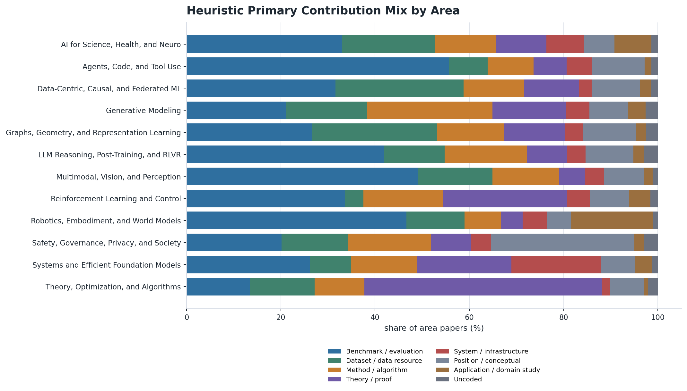

### program_signal_calibration.png

Oral-selection enrichment compared with AlphaXiv public-attention enrichment across taxonomy areas.

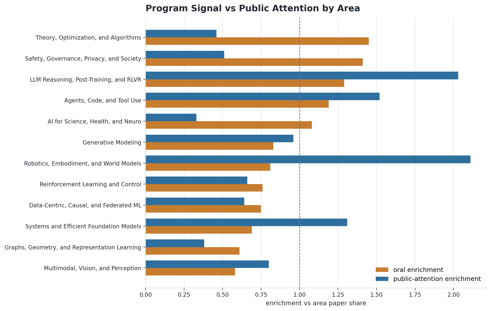

### arxiv_taxonomy_trends.png

Coarse arXiv query-count growth by taxonomy area, compared with ICML 2026 taxonomy share.

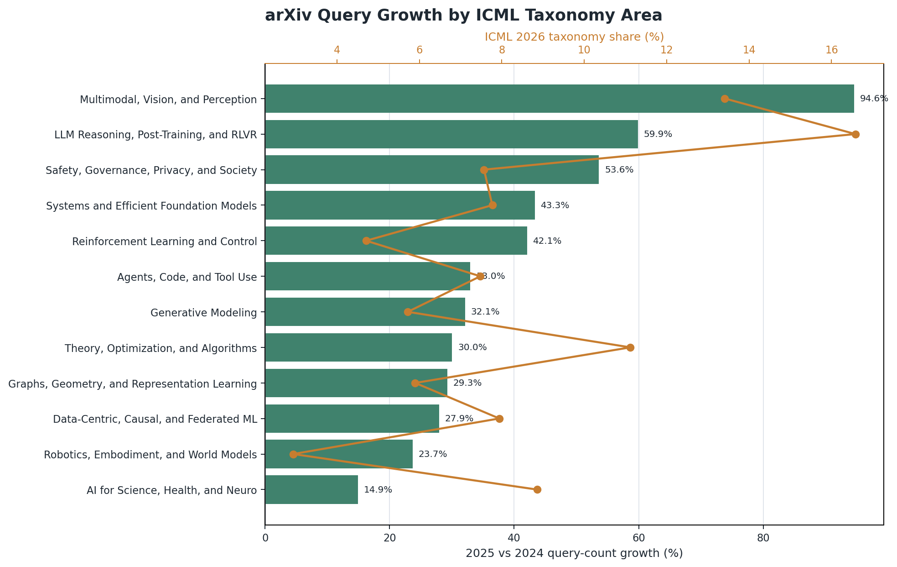

### historical_venue_area_deltas.png

ICML 2026 area-share deltas against accepted-paper baselines from ICML 2025, NeurIPS 2025, and ICLR 2026.

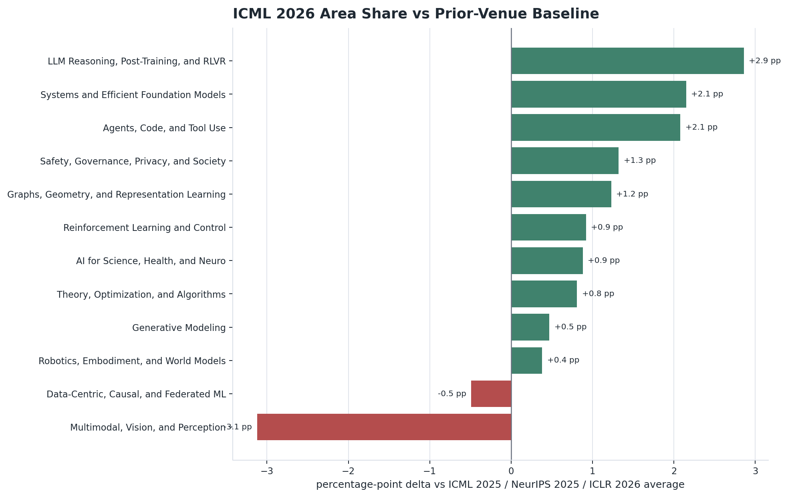

## Caveats

- Theme labels are rule-based and intentionally broad.
- Cluster labels come from TF-IDF terms, not manual semantic names.
- Semantic-map coordinates are a 2D PCA projection of transformer embeddings, so local neighborhoods are more meaningful than precise axis positions.
- Manual taxonomy areas are curated seed labels over semantic clusters, not a final ontology.
- Evidence contribution mixes are keyword/regex-derived triage labels, not verified paper annotations.
- Program-signal enrichment uses oral/award labels as conference-program signals, not complete quality labels.
- arXiv trend counts are broad overlapping query counts, not prior-conference acceptance trends.
- Historical venue deltas use a shared keyword scorer over accepted-paper metadata, with weaker title/topic-only coverage for venues whose static abstracts were unavailable.
- AlphaXiv metrics are public-attention signals, not quality labels.
- Institution and author figures inherit the canonicalization and name-disambiguation caveats in the collaboration report.